# Hi there, I'm Likai (Nianyi778) 👋

### 👨‍💻 Frontend Developer | Visualization Specialist
Based in Mainland China 🇨🇳

 

  

> *"Turning complex data into beautiful, interactive experiences."*

I am a developer specializing in **Data Visualization** and **Desktop Applications**. I focus on performance, user experience, and writing clean, maintainable code.

---

### 🌱 What I'm Working On
* **Professional**: Building high-performance visualization products to lead the industry.
* **Side Project**: Developing **[FlowMaster](https://github.com/nianyi778/FlowMaster)** 🚀, a productivity desktop app inspired by TickTick. (*Work in Progress*)
* **Learning**: Polishing my English skills for global technical communication.

### 💪 Challenges & Goals
* ☀️ **Morning Routine**: Early riser to maximize deep work time.
* 💻 **Coding**: Committing to **4+ hours** of development daily.
* 🏃 **Fitness**: Exercising **3 days** a week.
* 🌏 **Dream**: Aiming for a future career opportunity in **Japan** or **Europe**.

 

---

### 🛠 Tech Stack

| Frontend & Desktop | Backend & Database | Languages & Tools |
| :---: | :---: | :---: |
|     |     |     |
|  |  |     |

 

---

### 📊 GitHub Analysis

