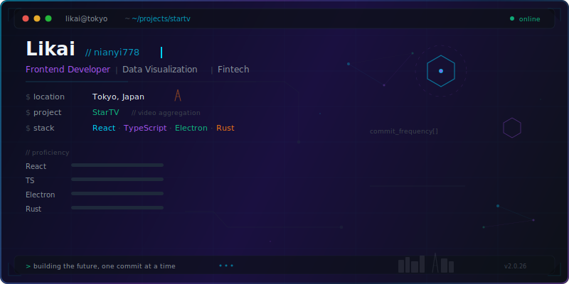
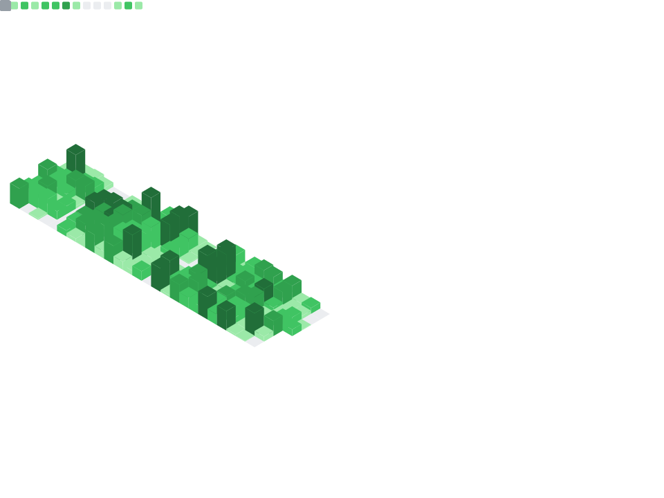

<!-- LANGUAGE SWITCHER -->
&nbsp;&nbsp;&nbsp;&nbsp;

<!-- HERO -->
# &lt;Likai /&gt; &nbsp;`Nianyi778`

&nbsp;&nbsp;
&nbsp;&nbsp;

**Frontend Developer** · **Data Visualization** · **Fintech**
 
`📍 Tokyo, Japan 🇯🇵`

 

 

> _"Turning complex data into beautiful, interactive experiences."_

 

---

 

<!-- ABOUT -->

### ⸻ &nbsp; About &nbsp; ⸻

 

I'm a developer specializing in **Data Visualization**, **Desktop Applications**, and **Online Payment Aggregation** — driving Japan's fintech digital transformation. I care deeply about performance, user experience, and writing clean, maintainable code that scales.

 

---

 

<!-- WORKING ON -->

### ⸻ &nbsp; What I'm Working On &nbsp; ⸻

 

- 🏦 **Professional** — Driving Japan's digital transformation in the fintech industry
- 🎬 **Side Project** — Building **[StarTV](https://star.divinations.top/)**, a free video aggregation platform
- 🌐 **Learning** — Polishing my Japanese & English skills for global technical communication

 

---

 

<!-- CHALLENGES & GOALS -->

### ⸻ &nbsp; Challenges & Goals &nbsp; ⸻

 

- ☀️ **Morning Routine** — Early riser to maximize deep work time
- 💻 **Coding** — Committing to **4+ hours** of development daily
- 🏃 **Fitness** — Exercising **3 days** a week
- 🌏 **Dream** — Exploring more opportunities across **Asia** and **Europe**

 

---

 

<!-- TECH STACK -->

### ⸻ &nbsp; Tech Stack &nbsp; ⸻

 

<table>
<tr>
<td align="center" width="25%">

**Frontend & Desktop**

 

 

 

</td>
<td align="center" width="25%">

**Mobile**

 

 

 

</td>
<td align="center" width="25%">

**Backend & Database**

 

 

 

</td>
<td align="center" width="25%">

**Languages & Tools**

 

 

 

</td>
</tr>
</table>

 

---

 

<!-- GITHUB STATS -->

### ⸻ &nbsp; GitHub Stats &nbsp; ⸻

 

&nbsp;&nbsp;

  

 

---

 

<!-- GITHUB METRICS -->

### ⸻ &nbsp; GitHub Metrics &nbsp; ⸻

 

 

---

 

<!-- CONTRIBUTION SNAKE -->

### ⸻ &nbsp; Contribution Snake &nbsp; ⸻

 

<picture>
  <source media="(prefers-color-scheme: dark)" srcset="https://raw.githubusercontent.com/nianyi778/nianyi778/output/github-contribution-grid-snake-dark.svg" />
  <source media="(prefers-color-scheme: light)" srcset="https://raw.githubusercontent.com/nianyi778/nianyi778/output/github-contribution-grid-snake.svg" />
  
</picture>

 

---

 

<!-- FOOTER -->

**Thanks for visiting!** If my work interests you, feel free to reach out.

 

&nbsp;&nbsp;
&nbsp;&nbsp;

